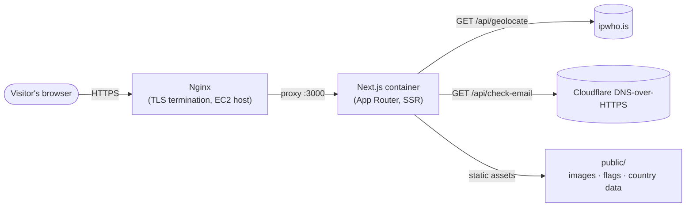
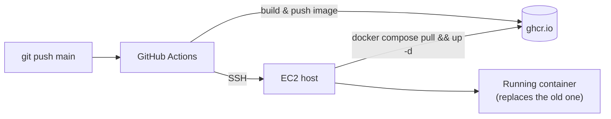
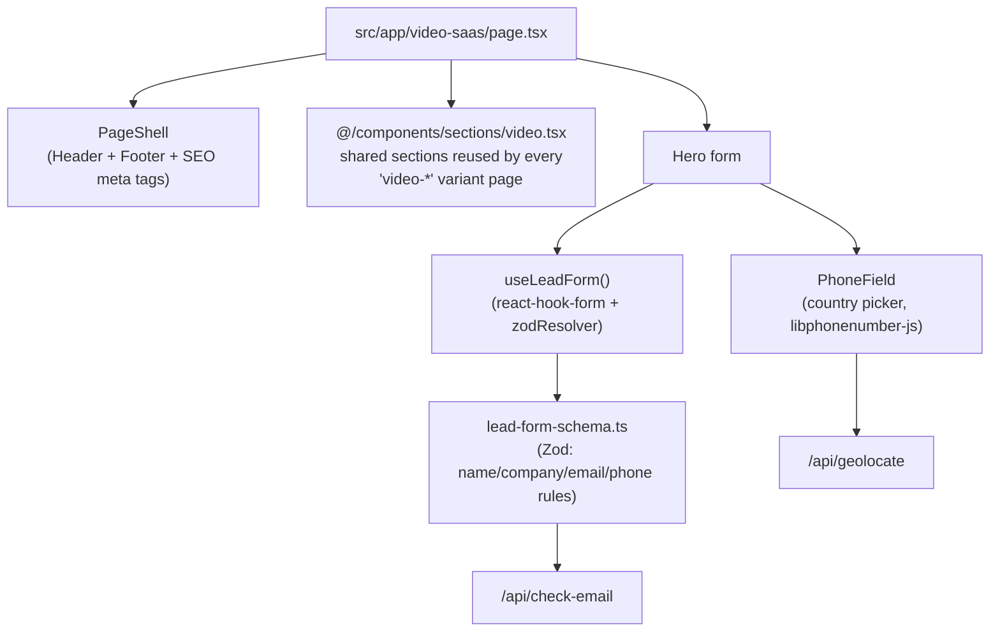

# gl-resources-lp

Get Levrg's marketing landing-page site: **65 landing pages** (video editing, social media, CRM, LinkedIn outbound, website optimization, and a fractional-team page) plus a self-contained lead-form validation system (phone country picker, name/company/email checks), built as a single **Next.js 16 App Router** app and deployed to **AWS EC2 via Docker + GitHub Actions**.

This repo is the merge of two previously separate projects — `GL-Vite-LP` (the Vite/React-Router landing pages) and `form-field-validator` (a standalone widget + two serverless functions) — rebuilt here as one app, with the widget replaced by native `react-hook-form` + `Zod` validation.

## Contents

- [Architecture](#architecture)
- [Project structure](#project-structure)
- [Getting started](#getting-started)
- [Environment variables](#environment-variables)
- [How the pages are built](#how-the-pages-are-built)
- [How the lead form works](#how-the-lead-form-works)
- [Contributing](#contributing)
- [Deployment](#deployment)

## Architecture

**Request flow in production:**



**Deploy pipeline (on every push to `main`):**



See [DEPLOYMENT.md](./DEPLOYMENT.md) for the one-time EC2 setup and the exact GitHub Secrets this pipeline needs.

**How one page is composed:**



## Project structure

```
gl-resources-lp/
├── public/
│   ├── images/, logos/, video/, favicon.webp, robots.txt, sitemap.xml
│   ├── data/countries.json, countries.by-iso2.json   # phone country picker data
│   └── flags/*.svg                                    # one SVG per country
├── src/
│   ├── app/
│   │   ├── layout.tsx, globals.css, page.tsx, not-found.tsx
│   │   ├── api/
│   │   │   ├── geolocate/route.ts      # IP -> country code (via ipwho.is, no API key)
│   │   │   └── check-email/route.ts    # email domain -> disposable/MX check
│   │   └── <route>/page.tsx            # one folder per landing page (65 total)
│   ├── components/
│   │   ├── layout/     # PageShell, Header, Footer
│   │   ├── shared/     # AnimatedSection, LeadForm, PhoneField, TrustedByMarquee, FaqSchema, ...
│   │   ├── sections/   # shared section bundles reused across a category's variant pages
│   │   ├── sample/     # mobile nav/sheet components used by a few page variants
│   │   └── ui/         # small Radix-based primitives (button, input, accordion, sheet, toast)
│   ├── hooks/           # use-toast.ts, useLeadForm.ts
│   └── lib/
│       ├── utils.ts
│       └── validation/lead-form-schema.ts   # the one Zod schema every form uses
├── scripts/optimize-images.mjs   # optional dev tool, not part of the build
├── Dockerfile, docker-compose.yml, .dockerignore
├── .github/workflows/deploy.yml
├── DEPLOYMENT.md                 # EC2 + GitHub Secrets setup
└── .env.example
```

## Getting started

**Prerequisites:** Node.js ≥ 20.9 and npm.

```bash
git clone <this-repo-url>
cd gl-resources-lp
npm install
cp .env.example .env.local
npm run dev
```

Open [http://localhost:3000](http://localhost:3000) — it redirects to `/video`. Every route listed in [Project structure](#project-structure) is reachable directly, e.g. `/video-saas`, `/crm-legal`, `/linkedin-outbound`.

**Other scripts:**

| Command | What it does |
|---|---|
| `npm run dev` | Start the dev server with hot reload |
| `npm run build` | Production build — also type-checks every page |
| `npm run start` | Run the production build locally (after `npm run build`) |
| `npm run lint` | ESLint across the whole project |
| `npm run optimize-images` | Optional: re-compress images under `public/images` |

## Environment variables

Copy `.env.example` to `.env.local` for local development:

| Variable | Required for | Notes |
|---|---|---|
| `IPWHOIS_ENDPOINT` | `/api/geolocate` (phone field's default-country detection) | Defaults to `https://ipwho.is` — no API key needed. If the lookup fails, the phone field falls back to its `defaultCountry` prop — the rest of the site works fine. |
| `NEXT_PUBLIC_SITE_URL` | Canonical/OG URLs, `metadataBase` | Defaults to `https://getlevrg.com` if unset. Set to `http://localhost:3000` locally if you want accurate meta tags while developing. |

`/api/check-email` needs no configuration — it uses Cloudflare's public DNS-over-HTTPS endpoint and the bundled `disposable-email-domains` package.

## How the pages are built

Each route is a normal Next.js page at `src/app/<route>/page.tsx`, composed from `PageShell` (site chrome + per-page SEO meta) plus a mix of shared and page-specific sections, styled entirely with Tailwind utility classes.

Six categories (`video`, `video-it-services`, `social`, `crm`, `website-optimization`, `linkedin-outbound`) each have a **base page** whose reusable sections live in `src/components/sections/<category>.tsx` — every "variant" page in that category (e.g. `video-saas`, `video-legal`, `video-accounting`) imports the sections it needs from there instead of duplicating them. A variant page typically only writes its own hero section and composes the rest from the shared file.

```tsx
// src/app/video-legal/page.tsx (shape of a typical variant page)
import { PageShell } from "@/components/layout/PageShell";
import {
  ToolsWeUseSection, ComparisonSection, FAQSection, /* ... */
} from "@/components/sections/video";

function HeroSection() { /* page-specific hero + lead form */ }

export default function Page() {
  return (
    <PageShell meta={{ title: "...", description: "...", ogImage: "/images/hero/video-legal-hero.webp" }}>
      <HeroSection />
      <ToolsWeUseSection />
      <ComparisonSection />
      <FAQSection />
    </PageShell>
  );
}
```

SEO note: `PageShell` renders `<title>`/`<meta>` tags directly in JSX from its `meta` prop. Next.js server-renders this on the first request, so crawlers see correct per-page metadata with no extra build step (unlike the old Vite setup, which needed a post-build script for this).

## How the lead form works

Every hero/lead form on the site validates the same five fields (first name, last name, email, phone, company) through one shared system — there's no per-page validation logic to maintain:

- **`src/lib/validation/lead-form-schema.ts`** — the Zod schema: name/company shape + denylist checks, email format + an async check against `/api/check-email` (disposable/no-MX detection), and phone validity via `libphonenumber-js` plus a fake-number-pattern filter, scoped to whichever country is selected.
- **`src/components/shared/PhoneField.tsx`** — the country-picker phone input (flag + dial code dropdown, sourced from `public/data/countries.json` + `public/flags/`), wired to the form via `react-hook-form`'s `useController`. Defaults its country from `/api/geolocate` on mount.
- **`src/hooks/useLeadForm.ts`** — wraps `useForm({ resolver: zodResolver(leadFormSchema) })` and redirects to `/thank-you` on a valid submit.

A typical form looks like this — copy this shape for any new form:

```tsx
const { register, control, handleSubmit, onValid, formState: { errors, isSubmitting } } = useLeadForm();

<form onSubmit={handleSubmit(onValid)} noValidate>
  <Input {...register("firstname")} />
  {errors.firstname && <p className="text-sm-body text-error mt-1">{errors.firstname.message}</p>}

  <PhoneField control={control} />
  {errors.phone && <p className="text-sm-body text-error mt-1">{errors.phone.message}</p>}

  <Button type="submit" disabled={isSubmitting}>Get a Quote</Button>
</form>
```

If you only need a plain lead form with no custom layout, render `<LeadForm idPrefix="..." />` from `src/components/shared/LeadForm.tsx` instead of writing the fields out by hand.

## Contributing

1. **Branch from `main`**: `git checkout -b feature/short-description`.
2. **Adding a new landing page:**
   - Pick (or create) the right category. If it's a variant of an existing category (video/social/crm/website-optimization/linkedin-outbound), import shared sections from `@/components/sections/<category>` rather than copy-pasting them.
   - Create `src/app/<your-route-slug>/page.tsx`, using an existing sibling page as your template.
   - If the page has a lead form, follow the pattern in [How the lead form works](#how-the-lead-form-works) — don't hand-roll validation.
   - Add the page's hero image to `public/images/hero/` and reference it in the `meta.ogImage` prop.
3. **Adding a field to the lead form:** change `lead-form-schema.ts` once — every page using `useLeadForm`/`LeadForm` picks it up automatically. Don't add per-page validation logic.
4. **Before opening a PR:**
   ```bash
   npm run lint
   npm run build
   ```
   `next build` type-checks and statically renders every route, so it will catch broken imports or SSR-unsafe code (e.g. reading `window` outside an effect) across the whole site, not just the page you touched.
5. **Open a PR against `main`.** Once merged, the [deploy workflow](#deployment) ships it automatically.

## Deployment

Deploys to AWS EC2 as a Docker container via GitHub Actions on every push to `main` — see [DEPLOYMENT.md](./DEPLOYMENT.md) for the one-time EC2 host setup and the GitHub Secrets required. There is no Vercel integration; `next build`'s `output: "standalone"` mode is what the `Dockerfile` runs.
